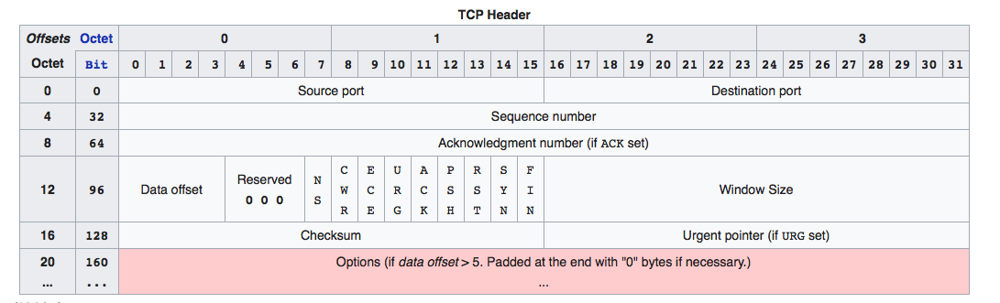

# Petunjuk Penggunaan Program

1. Download dan ekstract file zip

2. Buka cmd, ketik command ```make```

3. Buka dua window cmd yang berbeda (boleh dari 2 komputer yang berbeda namun terkoneksi pada jaringan yang sama)

4. Pada cmd pertama, ketik command ```./recvfile <filename> <windowsize> <buffersize> <port>```

5. Pada cmd kedua, ketik command ```./sendfile <filename> <windowsize> <buffersize> <hostname> <destination_port>```


# Cara Kerja Sliding Window

Pertama program sender dan receiver akan membuat socket UDP untuk melakukan komunikasi. Setelah itu, program sender akan menerima input file dan menyimpannya ke dalam buffer. Setiap data pada buffer akan dikirim ke receiver dalam tipe bentukan Segment, yang memiliki format sebagai berikut:

| SOH    | SeqNum | STX    | Data   | ETX    | Checksum |
| ------ | ------ | ------ | ------ | ------ | ---------|
| 1 byte | 4 byte | 1 byte | 1 byte | 1 byte | 1 byte   |

Ketika receiver menerima paket segment, receiver akan memeriksa apakah paket yang dikirim sudah benar dengan menggunakan nilai checksum. Data tersebut kemudian disimpan pada buffer dan ditulis ke file output, lalu juga akan dikirimkan acknowledgement dari receiver ke sender dengan format berikut: 

| ACK    | NextSeqNum | Advertised WinSize | Checksum |
| ------ | ---------- | ------------------ | -------- |
| 1 byte | 4 byte     | 1 byte             | 1 byte   |

Apabila sender tidak menerima ACK dalam waktu yang sudah ditentukan (pada kasus program ini ditentukan waktu timeout 1000ms), maka sender akan mengirim ulang segment ke receiver. Ketika sebuah frame pada window sender sudah mengirim Segment dan menerima ACK, window akan digeser (slide). Hal tersebut (dari membaca file, mengirim Segment, hingga mengirim ACK kembali) dilakukan terus menerus untuk setiap frame pada window hingga ditemukan EOF pada buffer sender. Ketika ditemukan EOF, sender mengirimkan data Endfile sehingga receiver mengenali dan tahu bahwa pengiriman file telah berakhir. 


## Fungsi - fungsi Terkait Sliding Window

Berikut adalah fungsi-fungsi yang terkait dengan sliding window:

1.  ```void sendSegment(Byte seqnum, Byte data, int sock, struct sockaddr_in receiverAddr, int slen)``` untuk mengirim pesan dari sender ke receiver

2.  ```void sendACK(Byte ack, int sock, struct sockaddr_in senderAddr, int slen, unsigned int seqnum, int checksum)``` untuk mengirim acknowledgement dari receiver ke sender

3.  ```void increaseWindow(RecvWindow* window)``` dan ```void decreaseWindow(RecvWindow* window)``` untuk mengubah ukuran sliding window receiver.

4.  ```string createCRC(string bitStr)``` untuk menghitung checksum dengan metode crc

5.  ```bool isFrameValid(Segment msg)``` untuk memeriksa apakah susunan segment memiliki bentuk yang valid

6.  ```void delHead(SendWindow* window)``` untuk menghapus bagian head dari window sehingga window mengecil

7.  ```void putBack(Byte data, SendWindow* window)``` untuk meletakkan sebuah data pada bagian belakang window

8.  ```Byte getChecksum(Segment msg)``` untuk mengenerate checksum dari sebuah segment

9.  ```void* receiveResponse(void*)``` fungsi sender untuk menerima respons (ACK) dari receiver

10. ```void* consumeBuffer(void*)``` fungsi receiver untuk menunggu pada waktu random untuk mensimulasi sliding window


# Pembagian Tugas

| Nama               | NIM      | Fungsi                                                                   |
| ------------------ | -------- | ------------------------------------------------------------------------ |
| Erick Wijaya       | 13515057 | sendSegment, putBack, delHead, setup, receiveResponse                    |
| Kezia Suhendra     | 13515063 | sendACK, increaseWindow, decreaseWindow, error, getBitString             |
| Catherine Almira   | 13515111 | createCRC, getChecksum, isFrameValid, consumeBuffer, insertIntoProcessBuf|


# Jawaban dari Pertanyaan

### Apa yang terjadi jika advertised window yang dikirim bernilai 0? Apa cara untuk menangani hal tersebut?

TCP Zero Window adalah keadaan dimana ukuran dari window pada suatu mesin tetap bernilai 0 dalam jangka waktu tertentu. Hal ini menandakan bahwa sementara client tidak dapat menerima data dan transmisi TCP akan terhenti hingga client dapat memroses data pada receive buffer. Ukuran window TCP merupakan banyaknya data (informasi) yang dapat diterima mesin pada saat sesi TCP dan masih mampu untuk memroses data. Pada saat mesin melakukan inisiasi koneksi TCP pada server, mesin akan memberi tahu server berapa banyak data yang dapat diterima dengan ukuran window.

Ketika sesi TCP sudah terinisiasi dan server mulai mengirimkan data, ukuran window pada client akan berkurang seiring dengan terisinya buffer yang ada. Pada saat yang bersamaan, client akan memroses data pada buffer dan mengosongkannya untuk membuat ruang kosong untuk lebih banyak data. Ketika ukuran window TCP (TCP Window Size) menjadi 0, client menjadi tidak dapat menerima data lagi hingga terjadi pemrosesan buffer kembali. Pada kasus ini biasanya akan diberikan peringatan oleh protocl expert megenai zero window pada expert view.

Hal ini dapat diatasi dengan cara mencari tahu apa yang sedang dilakukan client sebelum terjadi TCP Zero Window yang bisa saja terjadi diakibatkan oleh terlalu banyaknya proses yang dijalankan pada saat itu. Satu-satunya cara agar receiver dapat menerima data kembali adalah dengan menunggu hingga advertised window tidak bernilai 0.

### Sebutkan field data yang terdapat TCP Header serta ukurannya, ilustrasikan, dan jelaskan kegunaan dari masing-masing field data tersebut!

Setiap TCP header memiliki 10 field data dengan total ukuran sebesar 20 bytes (160 bits). TCP header juga dapat menambahkan alokasi data tambahan yang berukuran hingga 40 bytes. Field-field data yang terdapat pada TCP header adalah sebagai berikut.
  1. Source TCP port number (2 bytes).
  2. Destination TCP port number (2 bytes).
  3. Sequence number (4 bytes).
  4. Acknowledgement number (4 bytes).
  5. TCP data offset (4 bits).
  6. Reserved data (3 bits).
  7. Control flags (hingga 9 bits).
  8. Window size (2 bytes).
  9. TCP checksum (2 bytes).
  10. Urgent pointer (2 bytes).
  11. TCP optional data (0-40 bytes).
  


Berikut ini merupakan kegunaan dari masing-masing field data yang ada.
  - Source dan destination TCP port merupakan endpoints dari komunikasi saat mengirimkan dan menerima data device.
  - Sequence number digunakan oleh pengirim pesan untuk menandai urutan dari kelompok pesan-pesan yang ada.
  - Acknowledgement number digunakan oleh pengirim dan penerima pesan untuk mengkomunikasikan sequence number dari pesan yang akan dikirim atau yang baru saja diterima.
  - Data offset menyimpan ukuran total dari TCP header dalam kelipatan empat bytes. Jika header tidak menggunakan TCP optional data maka data offset akan menjadi 5 yang merepresentasikan 20 bytes. Namun, jika header menggunakan TCP optional data secara maksimal maka data offset menjadi 15 yang merepresentasikan 60 bytes.
  - Reserved data selalu memiliki nilai 0 dan digunakan untuk mensejajarkan ukuran total header menjadi kelipatan empat bytes yang penting untuk efisiensi dari data processing pada setiap komputer.
  - TCP menggunakan satu set yang berisi 6 standard control flags dan 3 extended control flags (dimana setiap bit merepresentasikan on atau off) untuk mengatur data flow pada situasi tertentu.
  - Window size digunakan pengirim untuk meregulasikan seberapa banyak data yang akan dikirimkan dan akan menerima acknowledgement number sebagai balasannya. Ketika window size terlalu besar atau terlalu kecil, akan memperlambat performansi dari pengiriman dan penerimaan data.
  - Checksum value akan dihasilkan dari protocol pengirim sebagai suatu teknik matematika yang akan membantu penerima untuk mendeteksi jika terjadi masalah pada pesan yang akan diterima seperti corrupted atau tampered with.
  - Urgent pointer pada umumnya diberi nilai 0 dan diabaikan, namun pada konjungsi dengan salah satu dari control flags, urgent pointer dapat digunakan sebagai data offset untuk menandai suatu subset dari pesan sebagai requiring priority processing.
